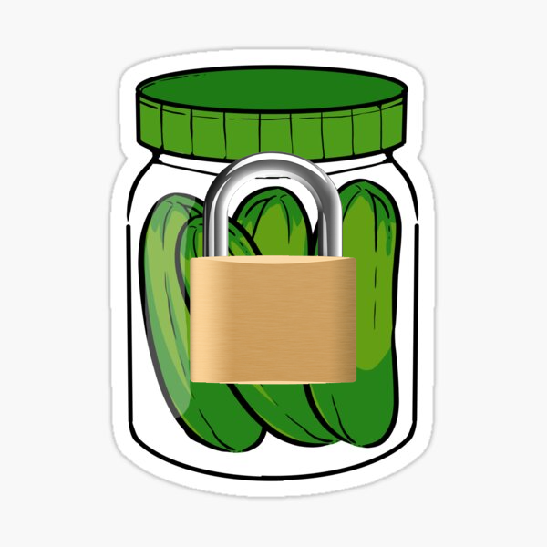

.. -*- mode: rst -*-
=================
Kosher Pickles
=================
-------------------------
Encryption module for securing serialized objects.
-------------------------

Introduction
============

Easily protect your serialized class objects with secure encryption. Kosher Pickles provides a Mixin you can use in any classes you wish to protect.

Installation
------------

Requirements:
~~~~~~~~~~~~

- cryptography
- pycryptodome
- pickle

=======

Install
~~~~~~~~~~~~~~~~~

Using ``pip``: ::

    pip install -U kosher

Conda package is in the works.

Usage
-----------

Kosher provides a pickle mixin, `KosherPickleMixin.` Adding this mixin to any class enables it to be encrypted transparently whenever it is saved as a .pkl file.

Example
~~~~~~~~~~~~~~~~~

Add Mixin to your existing class: ::

  class MyObjectClass(Object, KosherPickleMixin)
      def __init__():
        pass

Any object of the type `MyObjectClass` will now be pickled with encryption, and require the same secret for ``'pickle.load()'``

Development
-----------

Development is very active to accommodate a number of appoaches to using Kosher Pickles, and how private key management is handled.

It would be great to see more contributers to Kosher Pickles. We welcome any feature requests, and of course, pull requests.
In particular, if you are interested in expanding test coverage, this is (obviously) very important for an encryption module.

Source code
~~~~~~~~~~~

To check out the latest version for development or other use::

    git clone https://github.com/forestmars/kosher

Testing
~~~~~~~

To run the test suite make sure you have either pytest or Nose2 test runner installed and run as normal.

    *Nice module you got there. Would be a shame if someone were to write* **tests** *for it.*

Supported Standards
~~~~~~~~~~~

Kosher Pickles currently supports AES and Fernet.

The included AES implementation defaults to CBF (Cipher feedback) block cipher mode mode.

Fernet also uses 128-bit AES, but in CBC mode with PKCS7 padding, and HMAC using SHA256 for authentication.

Warning
~~~~~~~

N.B. Kosher Pickles is seriously strong encyption. If you lose the key phrase you created to secure your pickles, it's extremely unlikely you will recover them, unless you have access to a quantum comupter and a time span several orders of magnitude greater than the age of the known universe.

Project History
---------------

Based on a discussion at PyCon about the need to encrypted pickles in general, then created to meet financial company compliance requirements.

Roadmap
~~~~~~~
* Add support for AES-192 and AES-256.
* Add support for Galois/Counter Mode (GCM)

Additional Resources
---------------

https://csrc.nist.gov/projects/cryptographic-standards-and-guidelines/archived-crypto-projects/aes-development
